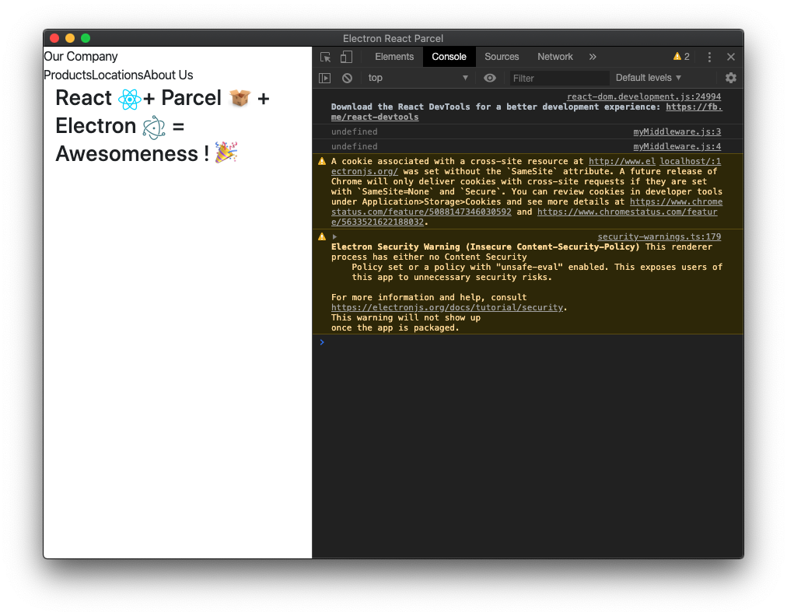

# How to Access Redux Store and Dispatch Function from Middleware?



## To Reproduce:

1. `yarn`
2. `yarn start`

## Details

Created a new middleware [`./src/middlewares/myMiddleware.js`](./src/middlewares/myMiddleware.js) but `getState` and `dispatch` are undefined.

**src/middlewares/myMiddleware.js**

```js
const myMiddleware = () => {
    return ({ getState, dispatch }) => {
        console.log(getState)       // undefined
        console.log(dispatch)       // undefined

        return next => action => {
            return next(action);
        }
    }
}

export default myMiddleware
```

**src/store.js**

```
...

const middlewares = [myMiddleware, thunk, router];
const enhancer = composeEnhancers(applyMiddleware(...middlewares), persistState());
const rootReducer = combineReducers(reducers);

return createStore(rootReducer, initialState, enhancer);
```

## Environment

| Software         | Version(s) |
| ---------------- | ---------- |
| Parcel           | 1.12.4
| Node             | v14.0.0
| Yarn             | 1.22.4
| Operating System | Mac OS X Catalina 10.15.3